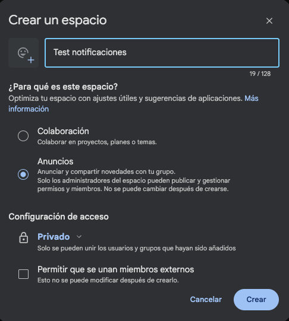
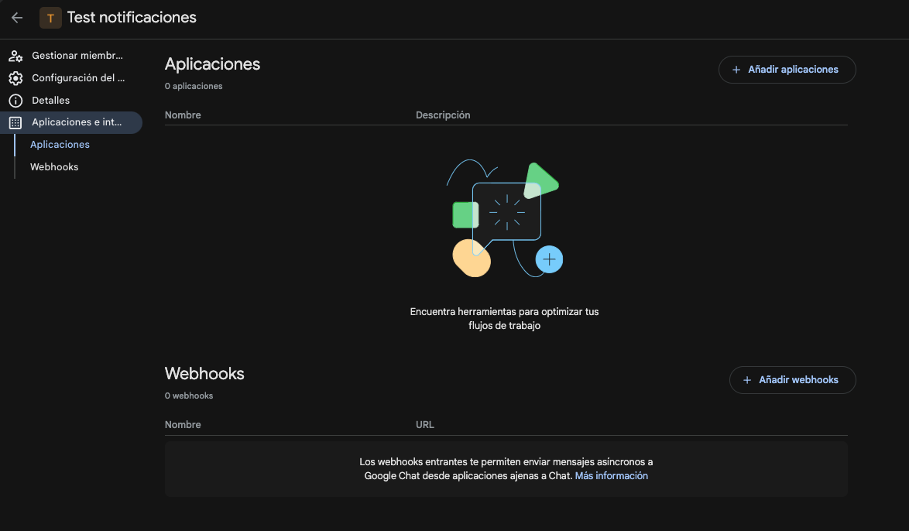
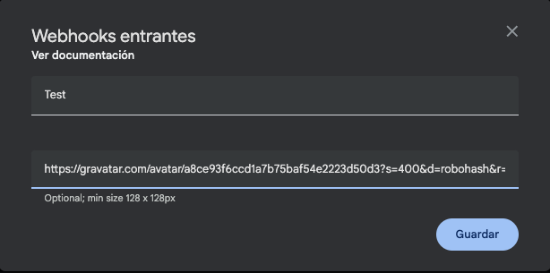
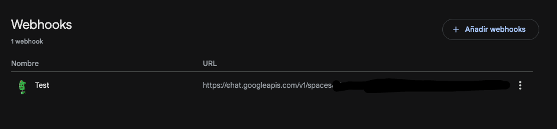
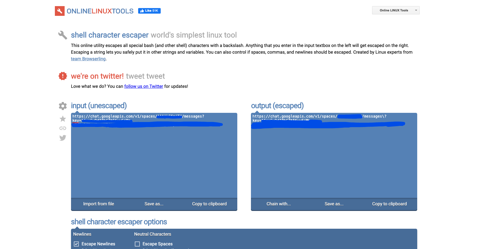
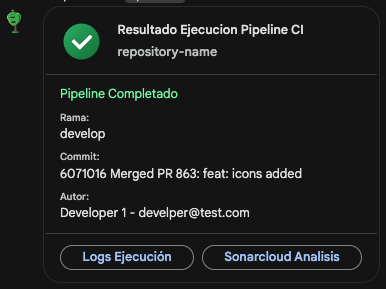
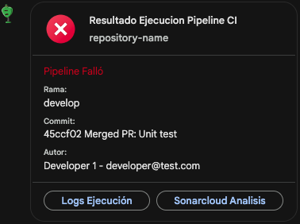

# Notificaciones para azure pipelines
---
En este repo vas encontrar diferentes formas de implementar las notificaciones de pipelines de azure devops en otra forma que no sea notificaciones a Teams, o sea, usando otros sistemas como Google chat o slack. en las primeras versiones se encontrara la version para google chat y en futuras ervoluciones implementaciones para mas sistemas de chat corporativos. 

---

## Google Chat

Para el uso del archivo correspondiente a esta herramienta, debes entrar a la carpeta _files_ y ahi encontras la carpeta con el nombre _google-chat_. Dentro de ella encontraras un solo archivo el cual contiene la ejecucion de un archivo bash, el cual configura una _card_ para ser enviada por medio de una peticion POST al Webhook de Google Chat.

#### Recomendaciones:

- Se deben configurar 3 variables VITALES para el funcionamiento de la tarea, estos deben hacerse ya sea con configuracion de variables de entorno al momento de ejecutar el stage, ya sea dentro de un grupo de variables, o poniendolas cada una al momento de ejecucion.

```bash
    webHookUrl=$(webhook-url)
    repositoryGroupURL=$(azure-url)
    stage=$(stage)
```

- La primera variable (webHookUrl) la vas a obtener, creando un grupo de chat tipo anuncios en el google chat:



una vez este creado, debes ir a la parte de configuraciones del espacio, luego a la parte de aplicaciones e integraciones y ahi te encontraras con el apartado de webhooks, procedemos a crear uno



Creando el webhook:



_nota: puedes configurarle un avatar si lo deseas, esto lo puedes hacer dando clic aca --> [GRAVATAR](https://vinicius73.github.io/gravatar-url-generator/#/)_



Una vez creado, copiamos la url y debemos pasarla por el siguiente conversor para que nos funcione sin problema: 

[CONVERSOR](https://onlinelinuxtools.com/escape-shell-characters)


Ya este es el valor necesario para usarlo en la variable webHookUrl

- Para el siguiente valor el cual es la URL del repositorio de Azure DevOps, debe ponerse la URL del proyecto de Azure DevOps de la siguiente manera:

        https://dev.azure.com/{Organization}/{Project}

- Para la ultima variable, ya es algo que se pone para mas orden en el momento de las notificaciones ya que informa el ambiente en el cual se esta ejecutan el pipeline, dando mas informacion. 

Este es el resultado final de la card creada y como se ve notificando:



Tambien notifica cuando el pipeline falla y cuando termina con errores:



_NOTA: El desarrollo de implementacion del boton de Sonarcloud esta en fase beta, una vez haya estabilidad subire la version_